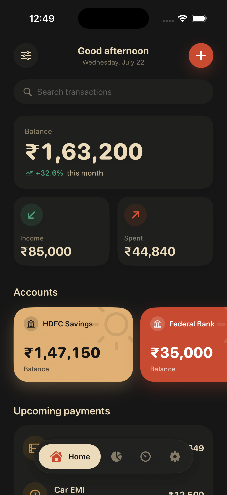
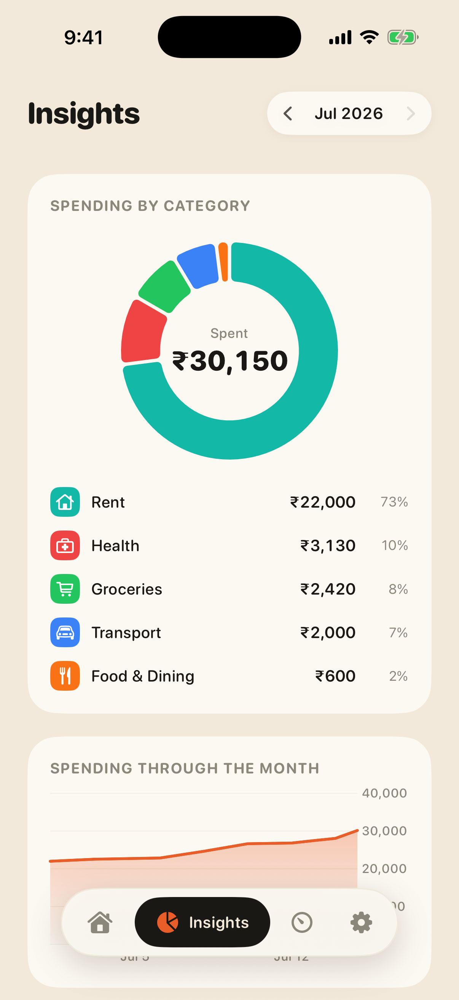
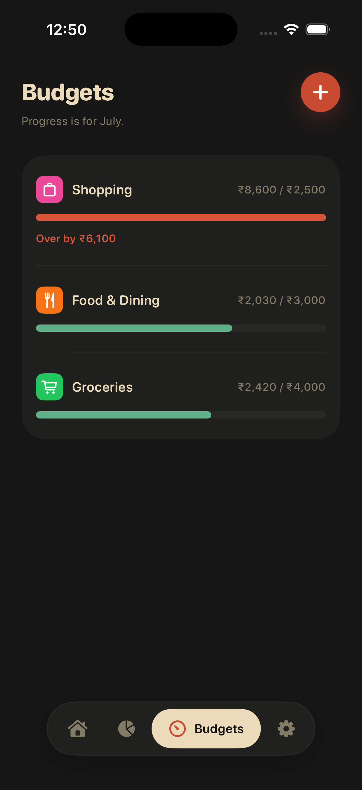
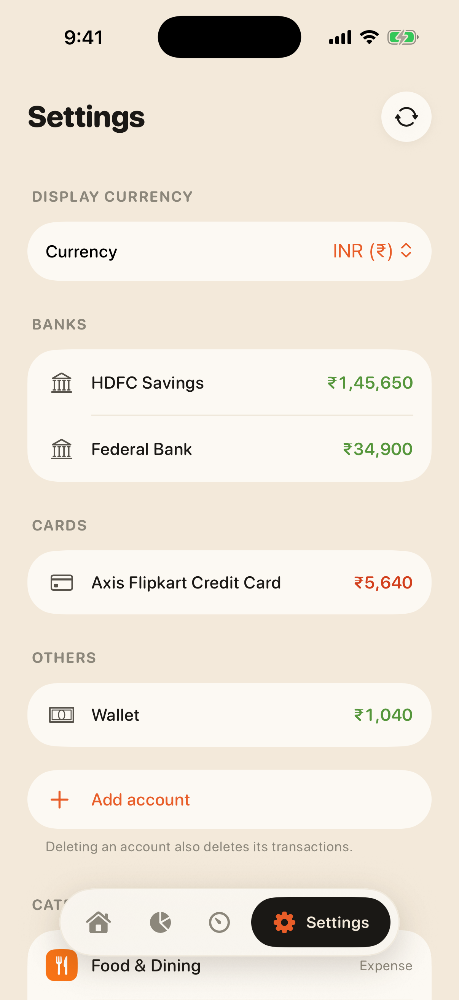
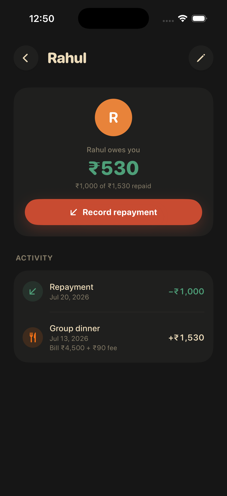
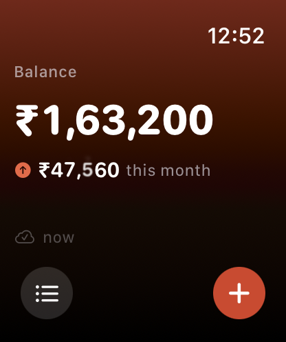
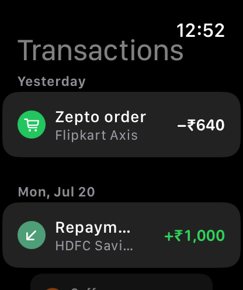
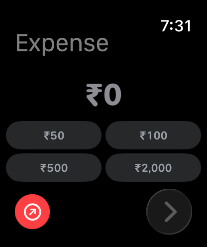
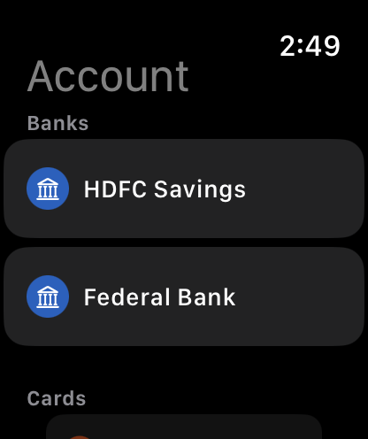

# Finlogue

A personal finance tracker for **iPhone and Apple Watch**, built with **SwiftUI**, **SwiftData**, and **WatchConnectivity**. Log payments from bank accounts, credit cards, and cash; move money between your own accounts with transfers; record card fees; split bills with friends and track who owes you back; categorize spending; set budgets; automate recurring payments, EMIs, and card bills — and do quick entry right from your wrist, with transactions syncing both ways between phone and watch.

---

## Screenshots

### iOS

| Home | Insights | **Budgets** | **Settings** |
| :---: | :---: | :---: | :---: |
|  |  |  |  |

| People | **Ledger & repayments** |
| :---: | :---: |
|  |  |

### WatchOS

| Home | Transactions | **Quick add** | **Account picker** |
| :---: | :---: | :---: | :---: |
|  |  |  |  |

---

## Features

### iOS app

- **Transactions** — add, edit, delete; income, expense, or **transfer**; notes; grouped by day with search and filters (type, account, category, **person**, date range). The name field suggests previously logged names as you type — tapping a suggestion also fills in that transaction's category, account, and amount for two-tap repeat entries.
- **Charges** — record extra fees on top of the amount (e.g. a credit-card surcharge). The total `amount + charges` is what's deducted from the account and reflected in the credit-card billing cycle; the fee shows as a lighter line beneath the amount on each transaction.
- **Split expenses & people** — split a bill among friends by entering each person's exact share; your share is the remainder. Only **your share** counts toward the Spent tile, insights, and budgets — the amounts you fronted are excluded because you'll be paid back — while the full bill still leaves your account. Each person has a **ledger** (Settings → People): their outstanding balance, every share they owe, and every repayment. **Record repayments** (partial or full) from a person's screen — logged as a settlement that returns money to an account but is kept out of income stats. Manage people (name + avatar colour) or add one inline while splitting, and filter the transaction list by person.
- **Transfers** — first-class moves between your own accounts (salary sweeps, credit-card bill payments). Both account balances update, but transfers are excluded from income/spent stats, charts, and budgets, so analytics reflect real earning and spending only.
- **Accounts** — bank, credit card, and cash accounts, grouped as **Banks / Cards / Others** everywhere they're listed. Balances are *computed* from transactions (no drift). Theme-colored gradient cards on the Home carousel with snap scrolling; card text auto-switches between light and dark for legibility in every theme.
- **Credit cards** — credit limit with a utilization gauge and available credit; editable **current outstanding** (rebase to match your real statement anytime); optional **statement day** for the billing cycle, which splits the outstanding into **billed vs unbilled** on the account card. Paying a bill (a transfer into the card) drains the billed amount first.
- **Categories** — customizable with SF Symbol icons and colors; sensible defaults (including Investments) seeded on first launch.
- **Insights** — Swift Charts with a nav-bar month switcher: spending-by-category donut with an in-place crossfading legend, cumulative daily spend trend, and income vs expense across the last 6 months. Subtle animations throughout the app — rolling numeric totals, animated budget bars, chart crossfades between months.
- **Budgets** — monthly limit per category with progress bars and over-budget warnings.
- **Recurring payments & mandates** — subscriptions, EMIs, loan auto-pay, and **recurring transfers** (e.g., a monthly salary sweep or card-bill autopay). Auto-post rules log the transaction when due (with catch-up for missed periods, each posted exactly once); confirm-first rules appear as Upcoming reminders on Home. Loans stop automatically after the last installment. Recurring expenses can also be **split** with people, so each posted occurrence carries the same shares (e.g. a subscription a flatmate splits with you).
- **Display currency** — INR by default, configurable in Settings.
- **Themes** — pick from **Tino** (warm cream & coral), **Plum** (ghost-white & plum), **Olive** (cornsilk & olive), **Ocean** (alice-blue & teal), or the dark **Noir** (charcoal & terracotta) in Settings. The whole app recolors instantly, and the choice syncs to the watch so it re-skins too. Dark themes flip system controls (menus, pickers, keyboard) to match; light themes are enforced light regardless of the system setting.

### WatchOS app

- Balance and this-month spend at a glance on a gradient home screen with compact toolbar controls, plus the recent transaction list and last-sync status.
- **Quick add** in three taps: amount (preset chips or digital crown) → category (recently used first) → account (grouped Banks / Cards / Others, last used first). Saves locally and syncs to the phone with a success haptic.

### Sync (WatchConnectivity)

- **Phone → Watch**: full snapshot via `updateApplicationContext` (durable, survives unreachability, deletions propagate) plus an instant `sendMessage` when reachable.
- **Watch → Phone**: new transactions via `sendMessage` with a queued `transferUserInfo` fallback; the phone dedupes by UUID, so double delivery is harmless.
- The phone is the source of truth; the watch keeps its own local SwiftData store so it works offline.

---

## Installation

### Prerequisites

- Xcode 16 or later
- iOS 17.6+ / watchOS 11+

### Steps

1. Clone and open:

   ```bash
   git clone https://github.com/JobinBiju/Finlogue.git
   cd Finlogue
   open Finlogue.xcodeproj
   ```

2. Select the **Finlogue** scheme and run (`Cmd + R`). The watch app is embedded and installs with the iOS app on a paired watch.

3. To test sync in simulators, use a paired iPhone + Watch simulator pair (`xcrun simctl list pairs`).

### Running on physical devices

1. Enable **Developer Mode** on both the iPhone and the watch (Settings → Privacy & Security → Developer Mode, then restart).
2. Run the **Finlogue** scheme to the iPhone; the watch app installs alongside. If the watch app doesn't appear, run the **FinWatch Watch App** scheme once with the "Apple Watch via iPhone" destination — this registers the watch in your provisioning profile.
3. First-time watch preparation (Xcode copying symbols) can take 10–20 minutes; keep the watch on its charger next to the phone.

### Debug launch arguments (DEBUG builds only)

- `-seedSampleData` — fills the store with two months of sample data (accounts, transactions, transfers, budgets, recurring rules).
- `-initialTab <0-3>` — opens the iOS app on a specific tab.
- `-showAddTransaction` / `-showAddRule` — opens the New Transaction or Recurring Payment sheet on launch.
- `-searchText <query>` — pre-fills the home search field.
- `-openAccounts` / `-openCategories` / `-openPeople` — pushes the Accounts, Categories, or People sub-screen from Settings.
- `-showAddCategory` / `-showAddPerson` — opens the category or person editor on launch.
- `-showFilter` — opens the transaction filter sheet on launch.
- `-insightsMonthOffset <±N>` — opens Insights N months from the current one.
- `-theme <tino|plum|olive|ocean>` — forces a theme at launch (iOS and watch).
- `-autoAddTestTransaction` (watch) — simulates a quick-add and syncs it to the phone.
- `-watchQuickAdd` / `-watchTransactions` (watch) — opens the quick-add flow or transaction list directly.
- `-quickAddAccountStep` (watch) — opens the quick-add flow directly on the account step.

---

## Project Structure

```
Finlogue/
├── Shared/                      # Compiled into BOTH targets
│   ├── Models/                  # SwiftData @Models: Transaction (transfers, charges,
│   │                            # splits, settlements), Account (groups, billing
│   │                            # cycle), Category, Budget, RecurringRule, Person,
│   │                            # TransactionSplit (+ enums)
│   ├── Sync/                    # Codable DTOs, SnapshotBuilder,
│   │                            # PhoneSyncEngine (iOS), WatchSyncEngine (watchOS)
│   └── Support/                 # AppSettings, CurrencyFormatter, Color(hex:)
├── Finlogue/                    # iOS app
│   ├── FinlogueApp.swift
│   ├── Services/                # TransactionStore (single mutation point),
│   │                            # RecurringEngine, InsightsService
│   └── Views/                   # Home, Editors, Insights, Budgets, Settings
└── FinWatch Watch App/          # watchOS app
    ├── FinWatchApp.swift
    └── Views/                   # WatchHome, WatchTransactionList, WatchQuickAdd
```

---

## License

This project is licensed under the MIT License. See the LICENSE file for details.

---

*Built with ☕️ by Jobin.*
